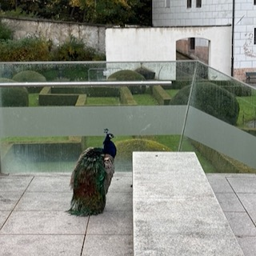
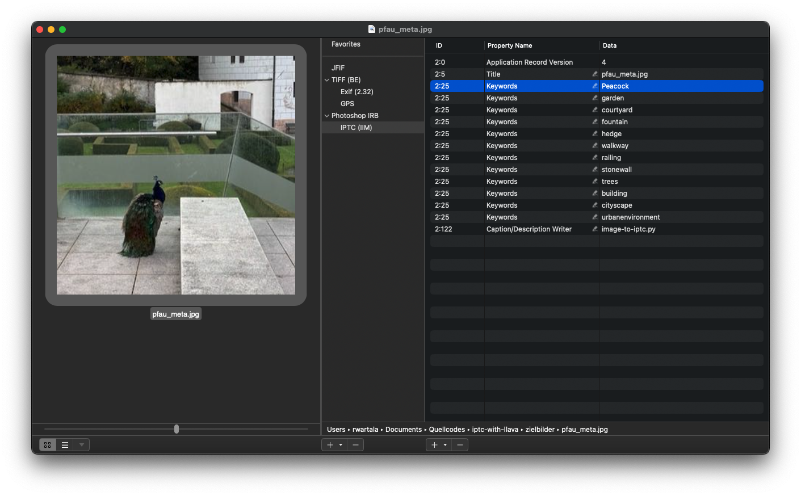

# iptc-with-llava
Short Python scipt to create IPTC keywords for any images with Ollama and LlaVA 

This Python script sequentially reads images from an input folder, sends them to a Llava 1.6 model within an Ollama instance using a special prompt and saves the resulting keywords in the IPTC block of the new image in the target folder.

## Quick Install

You can clone this repository with

```git clone https://github.com/rawar/iptc-with-llava.git```

Then you need to create a virtual Python environment with
```python3.11 -m venv .venv``` and ```source .venv/bin/activate```


After all, you need to install the dependencies with

```pip install -r requirements.txt```

### 1st Run

You can use the existing ```quellbilder``` and ```zielbilder``` folder for your source images and the images with the generated IPTC meta data.
You can use a local Ollama service or a Ollama instance somewhere in your local network. If you would like to use a local network Ollama service, please
use the ```base_url``` parameter inside Lanchains Ollama constructor.
Then you can put your images into ```quellbilder``` and run ```python image-to-iptc.py```. 

### Example

The following prompt generates keywords from the following image:

```Please find very precise keywords and separate them with commas.```



LlaVA 1.6 generates the following keywords:

